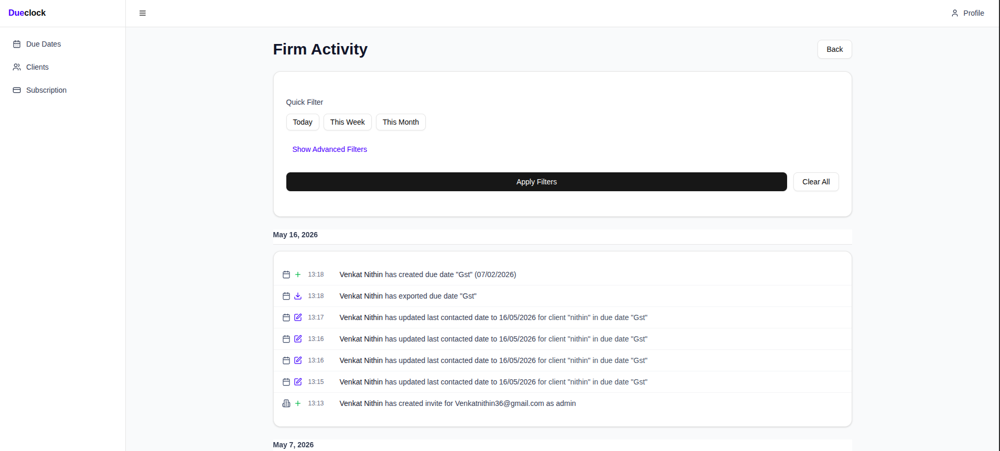
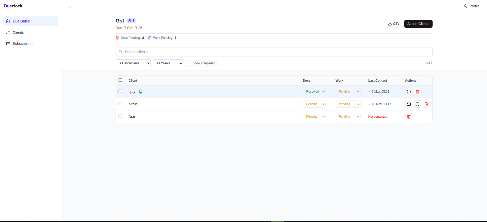
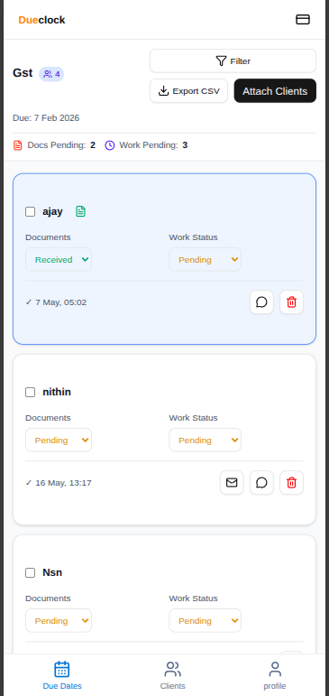
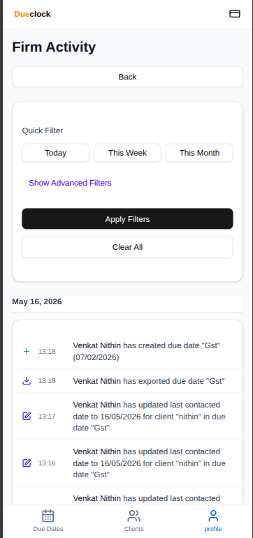

# DueClock – CA Due Date Tracking App

A clean, mobile-first PWA that helps Chartered Accountants track recurring compliance deadlines, manage clients, and communicate easily—all in one simple dashboard.

**Live Demo:** [https://dueclock.in](https://dueclock.in)
---

## Screenshots

<div align="center" style="max-width: 800px; margin: 0 auto;">
  <!-- Desktop Screenshots: Each on their own row to prevent squishing -->
  
  <br/>
  
  <br/>
  <!-- Mobile Screenshots: Side-by-side in the same row -->
  
  
</div>

---

## The Problem

CAs repeatedly handle the same monthly due dates and struggle to track all clients while communicating deadlines via WhatsApp and Excel. No mobile-friendly compliance tool exists.

So I built DueClock—a simple dashboard that automates recurring due dates, manages clients, tracks compliance status, and makes communication effortless.

---

## Tech Stack

- Next.js (App Router)
- React
- TailwindCSS
- MongoDB
- NextAuth / Sessions
- React Query (server state + API fetching)
- Zod (validation)
- Axios
- Vercel (hosting)

---

## Features & Authentication

- **Secure Google Login & Auth**: Powered by NextAuth with JWT session validation. Route protection middleware ensures that all dashboard and API routes require authentication.
- **Multiple Clients per Due Date**: Associate and manage multiple clients under a single due date with one click.
- **Seamless Communication**: Easily contact clients through bulk email and WhatsApp templates.
- **Role-based Team Management (Admin / Staff)**: Add team members to your CA firm with specific roles and permissions while tracking firm compliance activity logs in real-time.
- **CSV Client Import & Export**: Instantly import all your clients and due dates via CSV files for a quick setup.
- **PWA Ready**: Mobile-first design that can be installed directly from the browser like a native app.

---

## Why These Tools?

**shadcn/ui** – Works perfectly with React Hook Form. Great for MVPs where time matters.

**React Query** – Fast reactive UI changes with optimistic updates. Saves trouble fetching responses and managing error states.

**Zod** – Validates client and due date forms, plus API responses. Easy and prevents bad data.

**Google Auth + JWT + Session** – Secure login for web dashboards with fast API authorization and one-click Google OAuth.

---

## Folder Structure

```
app/
├── api/
│   ├── auth/
│   ├── clients/
│   ├── dashboard/
│   ├── duedate/
│   └── user/
├── clients/
├── dashboard/
├── duedates/
└── user/

components/
├── auth/
├── dialogs/
├── duedatecontent/
├── forms/
├── layout/
└── ui/        # shadcn components

hooks/
├── client/
├── dashboard/
├── due/
└── user/

lib/
├── auth/
├── db/
├── utils/
└── querykeys/

models/
├── User.ts
├── Client.ts
├── Firm.ts
├── DueDate.ts
├── Subscription.ts
└── Audit.ts

schemas/
├── formschemas.ts
└── apischemas.ts

public/
```

---

## Environment Variables

Create a `.env` file:

```env
MONGODB_URI=
NEXTAUTH_SECRET=
NEXTAUTH_URL=
GOOGLE_CLIENT_ID=      # optional
GOOGLE_CLIENT_SECRET=  # optional
```

---

## Installation

```bash
git clone https://github.com/VENKATNITHIN007/cahelp
cd cahelp
npm install
npm run dev
```

---

## Future Improvements

- Automatic reminder notifications (automated email or WhatsApp scheduling)
